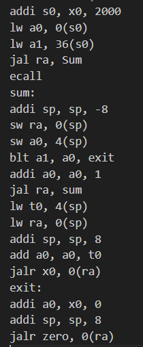
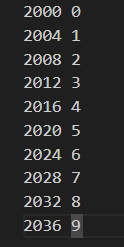
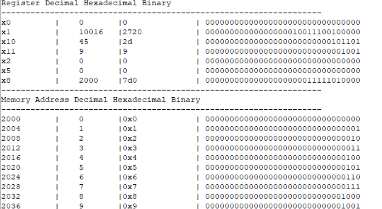

# RISC-V-32I Simulator

This project implements a RISC-V simulator in C++, aiming to emulate the execution of RISC-V assembly code. The simulator endeavors to replicate the behavior of a RISC-V ISA in executing assembly instructions, handling registers, memory, and program flow.

## Simulator Implementation and Design

### a. Implementation and Code

- **Programming Language**: C++ is chosen as the primary language due to familiarity and suitability for the project's requirements. A small Python GUI program is implemented to facilitate running the C++ simulator.
- **Class Structure**: The core logic of the simulator is encapsulated within a class named `RISCV_Instructions`. This class manages data structures such as maps for storing labels, accessing memory, and handling registers.
- **Program Flow**: 
  - The simulator prompts the user for the location of data, code, and the initial program counter.
  - Instructions are parsed, extracting essential information like instruction type and operands.
  - Memory is initialized using a data file, and instruction execution begins.
  - After each instruction execution, the simulator outputs the contents of registers and memory in decimal, binary, and hexadecimal formats.

### b. Design of Our Simulator

- **User Input**: Users specify the initial address of instructions to facilitate proper handling of jumping instructions.
- **Halting Instructions**: ECALL, EBREAK, and FENCE instructions are utilized to prevent infinite loops and ensure proper program termination.
- **Data File**: Users define memory locations and corresponding data values in a separate data file.
- **Instruction Format**: Instructions must adhere to specific formats for proper parsing, including correct spacing and comma placement.
- **Register Handling**: Supports both x base registers and named registers, ignoring capitalization.
- **Label Usage**: Instructions must be correctly positioned with respect to labels for proper parsing and execution.
- **Opcode File**: Utilized during parsing to facilitate instruction decoding.

## Simulator Usage Guide

1. Ensure assembly code and data files follow specified formats.
2. Compile the `RISCV_Instructions` class to generate an executable file.
3. Run the GUI program (`gui.py`), providing paths to the assembly code, data, and program counter.
4. Click the parse button to execute the simulation.
5. View the output, including program counter, instructions, modified registers, and relevant memory locations.

## Program Testing

Six sample programs are included to demonstrate the simulator's functionality across various scenarios, including iterative algorithms, recursion, bitwise operations, and array manipulation.

## Example Screenshots

### Example of Instructions file

*Description: This screenshot shows an example of a Assembly file (.asm) containing the assmebly instructions to be executed.*

### Example of Data File

*Description: This screenshot shows an example of a Data file (.txt) containing the Data required for the program.*

### Example of the final output

*Description: This screenshot shows an example of the final state of the registers and memory after the execution of the instructions.*

# RISC-V-32I-Simulator